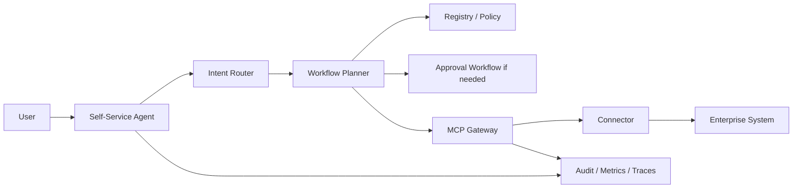

# MCP Platform Starter Kit

A reusable enterprise MCP onboarding platform for internal AI Platform teams.

This repo helps teams build, register, govern, observe, and consume MCP connectors through a central MCP Gateway. The first complete local path is Jira in mock mode, with ServiceNow included as the next golden connector example.

## What This Is

This is a self-service MCP onboarding starter kit, not just a connector repo.

It provides:

- a connector catalog and registry
- reusable connector templates
- a governed MCP Gateway
- RBAC, policy checks, approvals, audit, and observability
- mock auth and local secrets references
- Jira and ServiceNow connector examples
- ADK/MDK integration patterns
- self-service access and connector proposal flows
- OpenTelemetry, Prometheus, Grafana, Jaeger, and SIEM JSONL export

## Who Uses It

| User | What they do here |
|---|---|
| DS / Agent Developer | Use approved connectors from an ADK/agent app through MCP Gateway |
| Connector Owner | Generate and own a connector from a reusable template |
| Platform Admin | Approve connectors, access, and operating controls |
| Security Reviewer | Review data classification, secrets, write tools, and audit posture |
| ADK/MDK Developer | Wire agent/app templates to MCP Gateway instead of direct enterprise APIs |

## Quick Start

From the repo root:

```bash
npm install
npm run platform:start
```

Open:

- Developer portal: http://localhost:3000
- API / Gateway: http://localhost:4000
- Grafana: http://localhost:3001
- Prometheus: http://localhost:9090
- Jaeger: http://localhost:16686

Stop the stack:

```bash
npm run platform:stop
```

## Try The Main Flows

```bash
npm run demo:jira-search
npm run demo:jira-denied-write
npm run demo:jira-approved-write
npm run demo:servicenow-search
npm run demo:onboarding-agent
npm run demo:agent-search-jira
npm run demo:agent-create-servicenow-ticket
npm run demo:agent-onboard-servicenow
npm run demo:audit-events
npm run demo:observability
```

What these prove:

- Jira search is invoked through MCP Gateway, not directly.
- Jira write actions are approval-gated.
- Approved write execution can be resumed.
- ServiceNow mock connector works through the same gateway path.
- The self-service agent can turn plain English into access requests, approval-gated actions, or gateway calls.
- Audit events include request and trace IDs.
- Observability is available locally.

## Natural Language Self-Service Agent

Users can ask:

- “Can you help me onboard to ServiceNow?”
- “Can you create a ServiceNow ticket?”
- “Can you search Jira issues?”

The platform converts the request into one of these governed outcomes:

- access request
- SDD connector onboarding flow
- approval-required tool execution
- direct allowed gateway invocation
- unsupported request that asks for clarification



The agent does not call Jira or ServiceNow directly. It creates platform requests or calls MCP Gateway, where auth, RBAC, policy, approvals, audit, metrics, and traces are enforced.

Try it locally:

```bash
npm run demo:agent-search-jira
npm run demo:agent-create-servicenow-ticket
npm run demo:agent-onboard-servicenow
```

## How Someone Onboards

### Use An Existing Connector

1. Open http://localhost:3000.
2. Go to **Connector Catalog**.
3. Select Jira or ServiceNow.
4. Review tools, risk, and data classification.
5. Request project access.
6. After approval, configure the agent to call MCP Gateway.

ADK/agent apps should call:

```text
ADK Agent -> MCP Gateway -> Auth/RBAC/Policy -> Connector Tool -> Enterprise System
```

### Build A New Connector

Generate a connector scaffold:

```bash
npm run connector:create -- --name my-rest-connector --template generic-rest-api
```

Or generate a self-service connector repo package:

```bash
npm run onboard:connector -- --system servicenow --owner-team service-management-platform --mode new-repo
```

Generated connectors include a manifest, README, `.env.example`, Dockerfile, tool/resource/prompt folders, tests, and registration instructions.

### Request Or Propose Through The Portal

In the portal, use **Self-Service Requests**:

- **Request Jira access** creates an access request for an existing connector.
- **Propose ServiceNow connector** creates a new connector registration request with generated SDD artifacts.

Requests do not bypass governance. Platform/security approval is still required for production usage, restricted data, and high-risk write tools.

## Repository Map

| Folder | Purpose | Start here |
|---|---|---|
| `apps/` | API, Gateway, and web portal | [apps/README.md](apps/README.md) |
| `connectors/` | Working and example MCP connector runtimes | [connectors/README.md](connectors/README.md) |
| `packages/` | SDKs, gateway client, generator, policy core | [packages/README.md](packages/README.md) |
| `registry/` | Git-backed connector, skill, task, policy definitions | [registry/README.md](registry/README.md) |
| `infra/` | Docker Compose, Postgres, observability stack | [infra/README.md](infra/README.md) |
| `examples/` | ADK, MDK, generated connector examples | [examples/README.md](examples/README.md) |
| `docs/` | Architecture, onboarding, governance, diagrams | [docs/README.md](docs/README.md) |
| `templates/` | Reusable connector, skill, and task templates | [templates/README.md](templates/README.md) |
| `generated-repos/` | Local generated connector repo examples | [generated-repos/README.md](generated-repos/README.md) |
| `generated-requests/` | Local self-service request artifacts | [generated-requests/README.md](generated-requests/README.md) |

## Local Validation

```bash
npm run build
npm test
docker compose config
npm run platform:start
npm run demo:jira-search
npm run demo:observability
```

## Important Concepts

- **Connector**: an MCP server or integration exposing tools, resources, and prompts.
- **Tool**: callable action exposed by a connector.
- **Resource**: contextual data exposed by a connector.
- **Prompt**: reusable prompt/workflow template exposed by a connector.
- **Skill**: platform-owned enterprise capability composed from connectors/tools/resources/prompts.
- **Task**: platform-owned workflow definition using one or more skills.
- **Gateway**: the central runtime enforcement layer for auth, RBAC, policy, secrets, audit, metrics, and traces.

## Current Golden Paths

- Jira connector: mock mode plus API-token adapter.
- ServiceNow connector: mock mode plus API-token adapter.
- Local Knowledge Base connector: safe local example.
- Connector generator: reusable scaffold mechanism.
- Self-service onboarding: access requests and new connector proposals.

Most other enterprise connectors in the catalog are intentionally seed metadata only. They are present so platform teams can show the target catalog model without pretending every integration is already implemented.

## More Detail

- Architecture and diagrams: [docs/README.md](docs/README.md)
- DS onboarding: [docs/onboarding/ds-consume-existing-connector.md](docs/onboarding/ds-consume-existing-connector.md)
- Connector owner guide: [docs/onboarding/connector-owner-build-new-connector.md](docs/onboarding/connector-owner-build-new-connector.md)
- Self-service agent: [docs/self-service/self-service-agent-orchestrator.md](docs/self-service/self-service-agent-orchestrator.md)
- Natural language workflow: [docs/self-service/natural-language-to-mcp-workflow.md](docs/self-service/natural-language-to-mcp-workflow.md)
- ADK/MDK integration: [docs/adk-mdk-integration.md](docs/adk-mdk-integration.md)
- Observability: [docs/observability.md](docs/observability.md)
- SIEM audit export: [docs/siem-audit-export.md](docs/siem-audit-export.md)
- Production hardening: [docs/production-hardening-checklist.md](docs/production-hardening-checklist.md)
