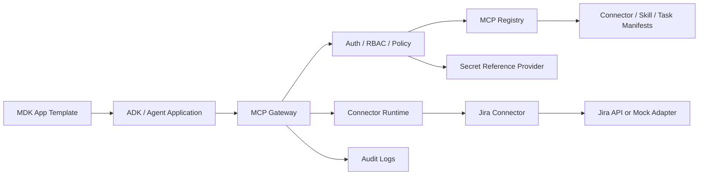
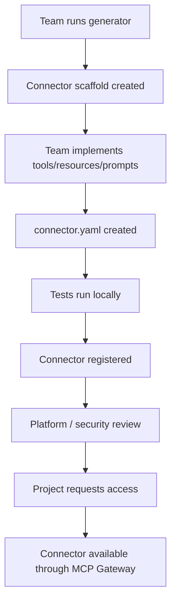
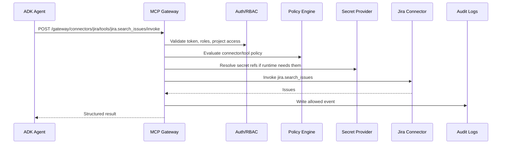
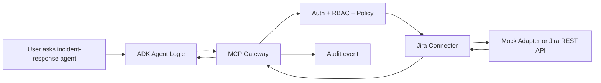
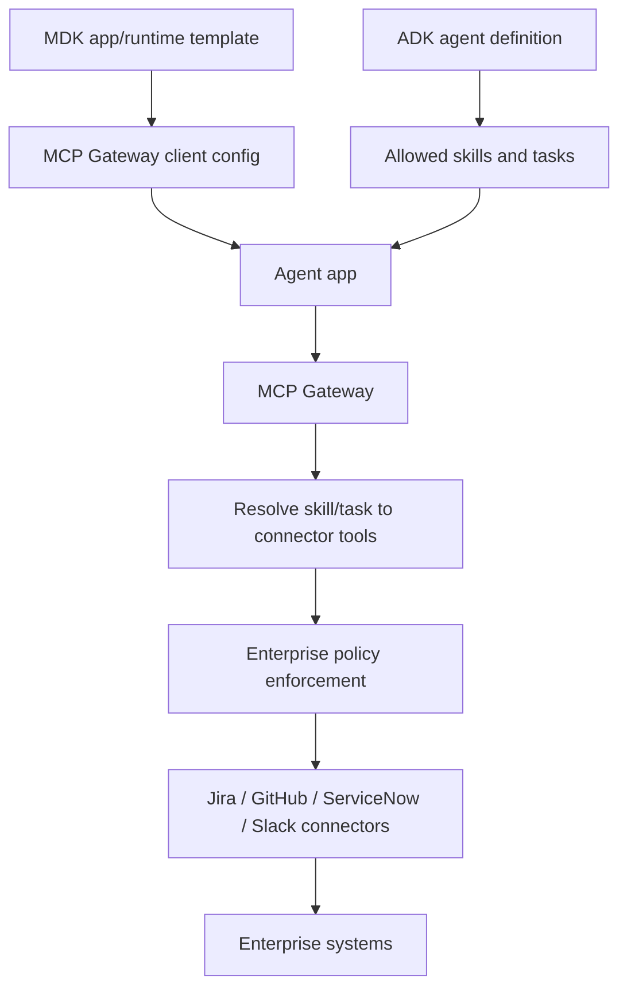
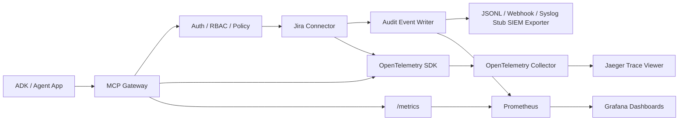

# MCP Platform Starter Kit

An enterprise MCP onboarding platform for AI Platform teams.

This repo is a reusable starter kit for teams that want to connect ADK agents, MDK app templates, or other internal agent applications to enterprise systems like Jira, GitHub, Confluence, ServiceNow, Slack, databases, and internal tools without bypassing platform governance.

The first end-to-end path is Jira in mock mode. A team can clone this repo, run the platform, inspect connector templates, register Jira, request access, invoke `jira.search_issues` through the MCP Gateway, and see audit events for allowed and denied calls.

## What Problem It Solves

Enterprise teams want to say:

> I want my AI agent to use Jira safely.

They should quickly get:

- a reusable connector template
- a working connector scaffold
- a connector manifest
- local dev instructions
- auth and secret placeholders
- tool/resource/prompt definitions
- policy defaults
- registry registration
- gateway invocation
- audit logs
- tests and examples
- ADK/MDK integration guidance

## Who Uses It

- AI Platform teams provide the paved road.
- Connector owners build and operate connectors.
- Security reviewers approve high-risk connectors and write tools.
- Project teams request access to approved connectors.
- ADK/MDK app teams call the MCP Gateway instead of calling enterprise systems directly.
- Auditors inspect allowed and denied runtime events.

## Core Concepts

MCP-native connector capabilities:

- **Tools**: callable actions exposed by connector runtimes.
- **Resources**: contextual data exposed by connector runtimes.
- **Prompts**: reusable prompt templates exposed by connector runtimes.

Enterprise platform abstractions:

- **Connectors**: MCP servers or integrations such as Jira or GitHub.
- **Skills**: governed reusable capabilities composed from connector tools/resources/prompts.
- **Tasks**: platform-owned workflow definitions that use skills.
- **Policies**: authorization, approval, risk, and runtime enforcement.
- **Audit**: accountable trail for registry changes and gateway execution.

Skills and Tasks are not required MCP primitives here. They are enterprise-owned definitions that make connector capabilities reusable and governable.

## Architecture



Control plane:

- connector registry
- skill registry
- task registry
- templates
- RBAC
- policy defaults
- project access requests
- approvals
- audit queries

Data plane:

- gateway authentication
- project access checks
- connector/tool authorization
- policy evaluation
- secret reference resolution hooks
- connector invocation
- allowed and denied audit events

## Connector Onboarding Flow



## Gateway Request Flow



Denied calls are also audited:

```json
{
  "error": "POLICY_DENIED",
  "reason": "Project does not have access to connector jira",
  "requestId": "..."
}
```

## Jira End-To-End Flow



## ADK / MDK Integration Flow



ADK should not call Jira directly. ADK should call the MCP Gateway so the platform can enforce RBAC, project access, tool policy, human approval, secret references, rate limits, and audit.

## Local Quickstart

```bash
npm install
cp .env.example .env
npm run db:generate
npm run db:deploy -w @mcp-platform/api
npm run db:seed
docker compose -f infra/docker-compose.yml up --build
```

Services:

- API and Gateway: `http://localhost:4000`
- Web portal: `http://localhost:3000`
- Jira connector mock mode: `http://localhost:4200`
- Local knowledge base connector: `http://localhost:4100`
- Prometheus: `http://localhost:9090`
- Grafana: `http://localhost:3001` (`admin` / `admin`, anonymous admin enabled locally)
- Jaeger trace UI: `http://localhost:16686`
- OTEL Collector: `http://localhost:4318` and `localhost:4317`

Local development without Docker:

```bash
npm run dev:jira
npm run dev:connector
npm run dev
npm run dev:web
```

## First Jira Mock Mode Test

Mint a developer token:

```bash
DEV_TOKEN=$(curl -s -X POST http://localhost:4000/auth/dev-token \
  -H 'content-type: application/json' \
  -d '{"email":"developer@example.com"}' | jq -r .token)
```

Invoke Jira through the gateway:

```bash
curl -s -X POST http://localhost:4000/gateway/connectors/jira/tools/jira.search_issues/invoke \
  -H "authorization: Bearer $DEV_TOKEN" \
  -H "content-type: application/json" \
  -d '{
    "projectId": "ai-platform-demo",
    "input": {
      "jql": "project = DEMO ORDER BY created DESC",
      "maxResults": 10
    }
  }'
```

Try a write action:

```bash
curl -s -X POST http://localhost:4000/gateway/connectors/jira/tools/jira.create_issue/invoke \
  -H "authorization: Bearer $DEV_TOKEN" \
  -H "content-type: application/json" \
  -d '{
    "projectId": "ai-platform-demo",
    "input": {
      "projectKey": "DEMO",
      "summary": "Bug from incident",
      "description": "Created through governed MCP Gateway"
    }
  }'
```

Expected: denied or approval-required because Jira write tools are high risk.

Read audit logs:

```bash
AUDITOR_TOKEN=$(curl -s -X POST http://localhost:4000/auth/dev-token \
  -H 'content-type: application/json' \
  -d '{"email":"auditor@example.com"}' | jq -r .token)

curl -s http://localhost:4000/audit/events \
  -H "authorization: Bearer $AUDITOR_TOKEN"
```

## Generate A New Connector

```bash
npm run create:connector -- --name my-jira-connector --template jira-like-issue-tracker
npm run create:connector -- --name my-rest-connector --template generic-rest-api
npm run create:connector -- --name my-docs-connector --template document-retrieval
```

Generated connectors include:

- `connector.yaml`
- `README.md`
- `.env.example`
- `Dockerfile`
- `src/server.ts`
- `src/tools/`
- `src/resources/`
- `src/prompts/`
- `src/auth/`
- `tests/`
- local fixture
- registration instructions

## Register A Connector

The Jira connector is already seeded through `apps/api/prisma/seed.ts` and represented in `registry/connectors/jira.yaml`.

API endpoints:

- `GET /connectors`
- `GET /connectors/{id}`
- `POST /connectors`
- `PUT /connectors/{id}`
- `POST /connectors/{id}/submit-review`
- `POST /connectors/{id}/approve`
- `POST /connectors/{id}/disable`
- `GET /connectors/{id}/tools`
- `GET /connectors/{id}/resources`
- `GET /connectors/{id}/prompts`

## Skills And Tasks

The practical skill example is `registry/skills/engineering-ticket-management.yaml`. It maps to:

- `jira.search_issues`
- `jira.get_issue`
- `jira.create_issue`
- `jira.add_comment`
- `jira.transition_issue`

The practical task example is `registry/tasks/create-jira-ticket-from-incident.yaml`. It uses:

- skill: `engineering-ticket-management`
- tool: `jira.create_issue`
- approval required: `true`

## RBAC, Policy, And Audit

Every gateway call checks:

1. caller authentication
2. project access
3. connector status
4. connector execute permission
5. tool execute permission
6. skill/task access when applicable
7. policy constraints
8. write-action approval requirements

Every allowed and denied gateway decision writes an audit event with actor, project, connector, skill, task, tool, decision, reason, request ID, and metadata.

## Observability And Audit Dashboard

The local stack includes OpenTelemetry SDK instrumentation in the API and Jira connector, an OpenTelemetry Collector, Prometheus, Grafana, Jaeger for traces, and a local JSONL SIEM audit exporter.



After `docker compose -f infra/docker-compose.yml up --build`, invoke Jira mock mode and then force an audit export:

```bash
curl -s -X POST http://localhost:4000/gateway/connectors/jira/tools/jira.search_issues/invoke \
  -H "authorization: Bearer $DEV_TOKEN" \
  -H "content-type: application/json" \
  -H "x-correlation-id: demo-trace-001" \
  -d '{"projectId":"ai-platform-demo","input":{"jql":"project = DEMO ORDER BY created DESC","maxResults":5}}'

curl -s -X POST http://localhost:4000/audit/export/run \
  -H "authorization: Bearer $AUDITOR_TOKEN"
```

Verify the observability path:

- Metrics: open `http://localhost:4000/metrics` or Prometheus at `http://localhost:9090` and query `mcp_gateway_requests_total`.
- Dashboards: open Grafana at `http://localhost:3001`, then browse the `MCP Platform` folder.
- Traces: open Jaeger at `http://localhost:16686`, select `mcp-platform-api`, and inspect spans for `auth.validate`, `rbac.check`, `policy.evaluate`, `gateway.invoke_tool`, `connector.invoke`, `connector.jira.search_issues`, and `audit.write_event`.
- Audit export: call `GET /audit/export/status`; local JSONL records are written in the API container at `/app/audit-exports/audit-events.jsonl` and persisted in the `audit-exports` Docker volume.

Useful endpoints:

- `GET /metrics`
- `GET /observability/health`
- `GET /observability/config`
- `GET /audit/events`
- `POST /audit/export/run`
- `GET /audit/export/status`

The telemetry sanitizer drops authorization headers, tokens, API keys, raw request bodies, comments, descriptions, and prompt text before attributes or audit export metadata are emitted.

## ADK Config Example

```yaml
agent:
  name: incident-response-agent
  allowed_tasks:
    - create-jira-ticket-from-incident
    - summarize-open-incidents

mcp:
  gateway_url: http://localhost:4000
  project_id: ai-platform-demo

skills:
  - incident-response-assistant
  - engineering-ticket-management
```

Flow:

`ADK agent -> MCP Gateway -> Policy/RBAC -> Skill/Task resolution -> Connector/tool invocation -> Enterprise system`

## Roadmap

- Replace mock auth with OIDC or SAML-backed identity.
- Integrate Vault, AWS Secrets Manager, GCP Secret Manager, Azure Key Vault, or Kubernetes Secrets.
- Add an approval execution queue for high-risk write tools.
- Split the gateway into an independently scalable data-plane service.
- Add managed OpenTelemetry, SIEM, and dashboard integrations for non-local environments.
- Add production-grade connector runtime sandboxing.
