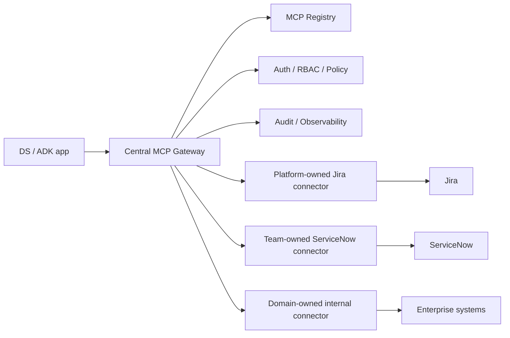
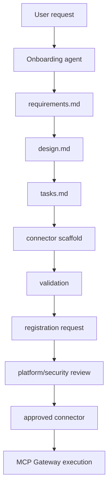
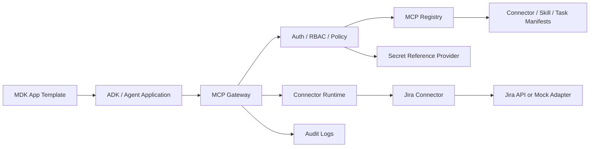
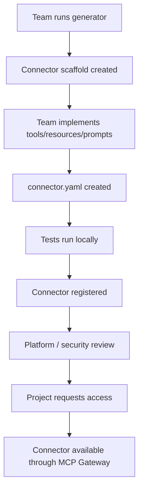
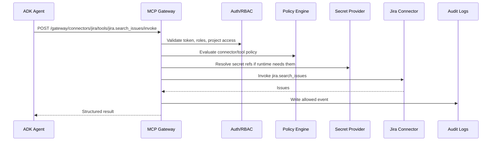
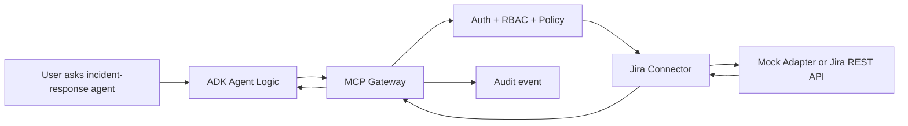
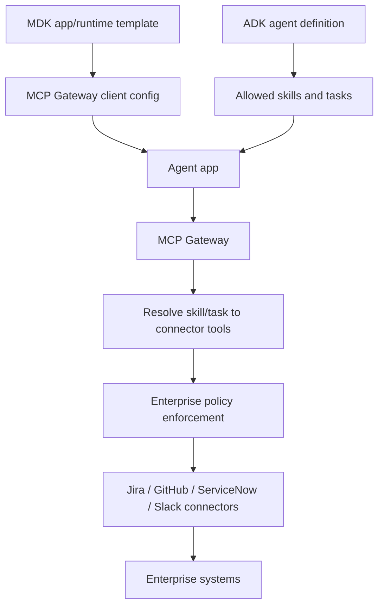
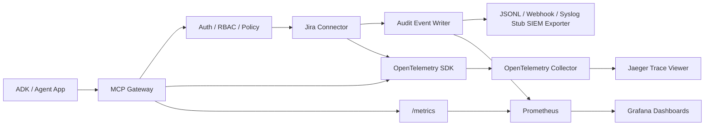

# MCP Platform Starter Kit

An enterprise MCP onboarding platform for AI Platform teams.

This repo is a reusable starter kit for teams that want to connect ADK agents, MDK app templates, or other internal agent applications to enterprise systems like Jira, GitHub, Confluence, ServiceNow, Slack, databases, and internal tools without bypassing platform governance.

The first end-to-end path is Jira in mock mode. A team can clone this repo, run the platform, inspect connector templates, register Jira, request access, invoke `jira.search_issues` through the MCP Gateway, and see audit events for allowed and denied calls.

## What Problem It Solves

Enterprise teams want to say:

> I want my AI agent to use Jira safely.

They should quickly get:

- a reusable connector template
- a working connector scaffold
- a connector manifest
- local dev instructions
- auth and secret placeholders
- tool/resource/prompt definitions
- policy defaults
- registry registration
- gateway invocation
- audit logs
- tests and examples
- ADK/MDK integration guidance

## Who Uses It

- AI Platform teams provide the paved road.
- Connector owners build and operate connectors.
- Security reviewers approve high-risk connectors and write tools.
- Project teams request access to approved connectors.
- ADK/MDK app teams call the MCP Gateway instead of calling enterprise systems directly.
- Auditors inspect allowed and denied runtime events.

## Choose Your Onboarding Path

| User type | Goal | Start here | Success looks like |
|---|---|---|---|
| DS / Agent Developer | Use approved connector | [DS onboarding guide](docs/onboarding/ds-consume-existing-connector.md) | Agent calls Jira through MCP Gateway |
| Connector Owner | Build new connector | [Connector owner guide](docs/onboarding/connector-owner-build-new-connector.md) | Connector generated, tested, and registered |
| Platform Admin | Govern usage | [Admin approval guide](docs/onboarding/platform-admin-approve-connector.md) | Connector approved and access controlled |
| Security Reviewer | Review risk | [Security checklist](docs/onboarding/security-reviewer-checklist.md) | High-risk tools gated and audited |
| ADK/MDK Developer | Wire app to gateway | [ADK](docs/onboarding/adk-agent-integration-guide.md) / [MDK](docs/onboarding/mdk-template-integration-guide.md) guides | App uses MCP Gateway, not direct system calls |

### Path A: DS / Agent Developer Consumes An Existing Connector

Example: "I want my agent to search Jira issues."

Flow:

1. Open the MCP Platform portal.
2. Browse Connector Catalog.
3. Select Jira Connector.
4. Review available tools: `jira.search_issues`, `jira.get_issue`, `jira.create_issue`, `jira.add_comment`, `jira.transition_issue`.
5. Request access for your project.
6. Platform/security approves access.
7. Get the MCP Gateway URL and project ID.
8. Configure your ADK/MDK app to call MCP Gateway.
9. Your agent invokes Jira through the gateway.
10. Gateway checks auth, RBAC, policy, project access, and tool permission.
11. Gateway calls the Jira connector.
12. Audit events, metrics, and traces are written.
13. Your agent app receives governed Jira results.

Local MVP proof with Jira mock mode:

```bash
DEV_TOKEN=$(curl -s -X POST http://localhost:4000/auth/dev-token \
  -H 'content-type: application/json' \
  -d '{"email":"developer@example.com"}' | jq -r .token)

curl -s -X POST http://localhost:4000/gateway/connectors/jira/tools/jira.search_issues/invoke \
  -H "authorization: Bearer $DEV_TOKEN" \
  -H "content-type: application/json" \
  -d '{
    "projectId": "ai-platform-demo",
    "input": {
      "jql": "project = DEMO ORDER BY created DESC",
      "maxResults": 10
    }
  }'
```

Denied write-action example:

```bash
curl -s -X POST http://localhost:4000/gateway/connectors/jira/tools/jira.create_issue/invoke \
  -H "authorization: Bearer $DEV_TOKEN" \
  -H "content-type: application/json" \
  -d '{
    "projectId": "ai-platform-demo",
    "input": {
      "projectKey": "DEMO",
      "summary": "Bug from incident",
      "description": "Created through governed MCP Gateway"
    }
  }'
```

This proves governance is enforced at runtime, not only represented as catalog metadata. The same flow is available without `jq` via:

```bash
npm run demo:jira-search
npm run demo:jira-denied-write
npm run demo:audit-events
```

### Path B: Connector Owner Builds A New Connector From Template

Example: "My team wants to add a ServiceNow connector."

Flow:

1. Clone the repo.
2. Run the connector generator.
3. Choose a template.
4. Implement tools/resources/prompts.
5. Fill out `connector.yaml`.
6. Add `.env.example` with secret placeholders only.
7. Add tests.
8. Run the connector locally.
9. Register the connector in the registry.
10. Submit for platform/security review.
11. Project teams request access.
12. Approved projects invoke the connector through MCP Gateway.

Generator commands:

```bash
npm run connector:create -- --name my-jira-connector --template jira-like-issue-tracker
npm run connector:create -- --name my-rest-connector --template generic-rest-api
npm run connector:create -- --name my-docs-connector --template document-retrieval
```

Generated connectors include `connector.yaml`, `README.md`, `.env.example`, `Dockerfile`, `src/server.ts`, `src/tools/`, `src/resources/`, `src/prompts/`, `src/auth/`, `tests/`, local fixtures, and registration instructions. This generator is the reusable onboarding mechanism for new enterprise connectors.

See [examples/generated-connectors/sample-servicenow](examples/generated-connectors/sample-servicenow/) for a lightly customized generated connector that shows the complete output shape.

### Path C: ADK/MDK Application Integrates With The MCP Gateway

Model:

- MDK = app/runtime template layer.
- ADK = agent behavior/workflow layer.
- MCP Platform = governed enterprise tool/connectivity layer.

ADK agents and MDK app templates should not call Jira, GitHub, ServiceNow, Slack, databases, or other enterprise systems directly. They should call MCP Gateway.

Flow:

`ADK Agent -> MCP Gateway -> Auth/RBAC/Policy -> Skill/Task Resolution -> Connector Tool -> Enterprise System`

Example config:

```yaml
agent:
  name: incident-response-agent
  allowed_tasks:
    - create-jira-ticket-from-incident
    - summarize-open-incidents

mcp:
  gateway_url: http://localhost:4000
  project_id: ai-platform-demo

skills:
  - incident-response-assistant
  - engineering-ticket-management
```

This lets the platform enforce authentication, RBAC, project access, connector access, tool-level policy, human approval for write tools, secret references, rate limits, audit logs, OpenTelemetry traces, Prometheus metrics, and SIEM audit export.

### Path D: Platform Admin / Security Reviewer Governs Connector Usage

Flow:

1. Review connector manifest.
2. Review risk level and data classification.
3. Review tools/resources/prompts.
4. Check write actions.
5. Verify secret handling uses references only.
6. Approve or reject connector.
7. Approve project access.
8. Monitor gateway metrics.
9. Review audit logs.
10. Export audit events to SIEM.

Jira write tools such as `jira.create_issue`, `jira.add_comment`, and `jira.transition_issue` are high-risk and should require approval by default.

Onboarding docs:

- [DS consumes an existing connector](docs/onboarding/ds-consume-existing-connector.md)
- [Connector owner builds a new connector](docs/onboarding/connector-owner-build-new-connector.md)
- [Platform admin approves a connector](docs/onboarding/platform-admin-approve-connector.md)
- [Security reviewer checklist](docs/onboarding/security-reviewer-checklist.md)
- [ADK agent integration guide](docs/onboarding/adk-agent-integration-guide.md)
- [MDK template integration guide](docs/onboarding/mdk-template-integration-guide.md)

## Operating Model

This starter kit uses a hybrid enterprise MCP model.

Recommended enterprise model:

- Centralized control plane.
- Centralized MCP Gateway.
- Platform-owned common connectors.
- Distributed ownership for custom/domain connectors.
- All execution still flows through MCP Gateway for policy, audit, observability, and secrets governance.

AI Platform centrally owns the registry, gateway, auth/RBAC, policy, audit, observability, connector templates, approval workflow, SDKs, onboarding agent framework, and platform-owned common connectors such as Jira.

Domain teams own distributed connector runtimes for systems they understand best. A service-management team can own a ServiceNow MCP server, a data platform team can own a Snowflake connector, and an internal tools team can own domain-specific MCP servers. Those teams maintain connector code, tool schemas, runtime SLOs, upstream API compatibility, docs, and connector-specific support.

Teams request access to existing connectors when the catalog already has what they need. Teams create new connectors when no approved connector exists or when a domain-specific runtime is required. Platform/security reviews connector manifests, ownership, data classification, write actions, secret references, and production access before enablement.

An onboarding agent guides users through access requests or new connector creation. It can collect intake, generate SDD artifacts, scaffold a connector repo, run validation, and prepare a review package. It does not approve production use.

Hybrid is the default because centralized-only bottlenecks AI Platform, while distributed-only creates inconsistent governance. Hybrid keeps governance centralized and ownership scalable.



Operating model docs:

- [Centralized vs distributed MCP](docs/architecture/centralized-vs-distributed-mcp.md)
- [MCP server ownership](docs/operating-model/mcp-server-ownership.md)
- [Connector lifecycle](docs/operating-model/connector-lifecycle.md)
- [Support and on-call](docs/operating-model/support-and-oncall.md)
- [Environment promotion](docs/operating-model/environment-promotion.md)
- [Connector runtime contract](docs/contracts/mcp-connector-runtime-contract.md)
- [Human approval workflow](docs/governance/human-approval-workflow.md)

## Self-Service And Agent-Assisted Onboarding

The platform supports three self-service modes.

1. Portal form: a user fills a form to request connector access or propose a new connector.
2. CLI: a user runs onboarding commands to generate access requests or connector repos.
3. Onboarding agent: a user asks a natural language question and the agent converts it into SDD artifacts, connector scaffold, validation output, and a review request.

The onboarding agent does not bypass governance. It accelerates intake, scaffolding, validation, and PR creation. Platform/security approval is still required for production use, restricted data, and high-risk write tools.



When a user asks, "I need my agent to use ServiceNow," the onboarding agent follows Spec-Driven Development:

1. Intake
2. Registry check
3. Reuse-or-build decision
4. `requirements.md` generation
5. `design.md` generation
6. `tasks.md` generation
7. `connector.yaml` generation
8. `policy.yaml` generation
9. repo scaffold generation
10. local validation
11. registration request generation
12. PR creation or review package creation
13. platform/security approval routing

For existing connectors:

```bash
npm run onboard:access -- --connector jira --project ai-platform-demo --tools jira.search_issues
```

For new connectors:

```bash
npm run onboard:connector -- --system servicenow --owner-team service-management-platform --mode new-repo
npm run connector:create-repo -- --name servicenow-mcp-connector --template generic-rest-api --owner-team service-management-platform
```

The generated connector repo can be written inside `examples/generated-connectors/`, written as a standalone folder under `generated-repos/`, or created as a GitHub repo when `GITHUB_TOKEN` and `GITHUB_ORG` are configured. Local generation works without network access.

Self-service docs and examples:

- [Self-service onboarding model](docs/self-service/self-service-onboarding-model.md)
- [Agent-assisted onboarding](docs/self-service/agent-assisted-onboarding.md)
- [Spec-driven onboarding agent](docs/self-service/spec-driven-onboarding-agent.md)
- [Generated connector repo model](docs/self-service/generated-connector-repo-model.md)
- [Request lifecycle](docs/self-service/request-lifecycle.md)
- [Spec-driven connector template](docs/templates/spec-driven-connector-template.md)
- [Existing Jira access request](examples/self-service/existing-jira-access-request.yaml)
- [New ServiceNow connector request](examples/self-service/new-servicenow-connector-request.yaml)
- [Agent-assisted ServiceNow onboarding example](examples/self-service/agent-assisted-servicenow-onboarding.md)
- [Generated ServiceNow connector repo](generated-repos/servicenow-mcp-connector/)

## Core Concepts

MCP-native connector capabilities:

- **Tools**: callable actions exposed by connector runtimes.
- **Resources**: contextual data exposed by connector runtimes.
- **Prompts**: reusable prompt templates exposed by connector runtimes.

Enterprise platform abstractions:

- **Connectors**: MCP servers or integrations such as Jira or GitHub.
- **Skills**: governed reusable capabilities composed from connector tools/resources/prompts.
- **Tasks**: platform-owned workflow definitions that use skills.
- **Policies**: authorization, approval, risk, and runtime enforcement.
- **Audit**: accountable trail for registry changes and gateway execution.

Skills and Tasks are not required MCP primitives here. They are enterprise-owned definitions that make connector capabilities reusable and governable.

## Architecture



Control plane:

- connector registry
- skill registry
- task registry
- templates
- RBAC
- policy defaults
- project access requests
- approvals
- audit queries

Data plane:

- gateway authentication
- project access checks
- connector/tool authorization
- policy evaluation
- secret reference resolution hooks
- connector invocation
- allowed and denied audit events

## Connector Onboarding Flow



## Gateway Request Flow



Denied calls are also audited:

```json
{
  "error": "POLICY_DENIED",
  "reason": "Project does not have access to connector jira",
  "requestId": "..."
}
```

## Jira End-To-End Flow



## ADK / MDK Integration Flow



ADK should not call Jira directly. ADK should call the MCP Gateway so the platform can enforce RBAC, project access, tool policy, human approval, secret references, rate limits, and audit.

## Local Quickstart

```bash
npm install
cp .env.example .env
npm run db:generate
npm run db:deploy -w @mcp-platform/api
npm run db:seed
docker compose up --build
```

Services:

- API and Gateway: `http://localhost:4000`
- Web portal: `http://localhost:3000`
- Jira connector mock mode: `http://localhost:4200`
- Local knowledge base connector: `http://localhost:4100`
- Prometheus: `http://localhost:9090`
- Grafana: `http://localhost:3001` (`admin` / `admin`, anonymous admin enabled locally)
- Jaeger trace UI: `http://localhost:16686`
- OTEL Collector: `http://localhost:4318` and `localhost:4317`

Local development without Docker:

```bash
npm run dev:jira
npm run dev:connector
npm run dev
npm run dev:web
```

## Validated Local Workflow

The repo is wired so a clean checkout can be validated from the root without manually building workspace packages one by one.

```bash
npm install
npm run build
npm test
docker compose config
docker compose up --build --wait
```

What this validates:

- Workspace build order: shared types, policy core, SDKs, task runner, API, web, and connectors.
- API tests can resolve `@mcp-platform/policy-core` after the root build.
- Web TypeScript builds with NodeNext-compatible `.js` relative imports.
- Docker Compose starts the full local stack from the root `compose.yaml`.
- API image includes OpenSSL/CA certificates so Prisma migrations run in Docker.
- Prometheus, Grafana, Jaeger, OTEL Collector, Jira mock connector, API, web, and Postgres start together.

The legacy compose file remains at `infra/docker-compose.yml`, but the preferred developer command is now plain `docker compose ...` from the repository root.

## First Jira Mock Mode Test

Mint a developer token:

```bash
DEV_TOKEN=$(curl -s -X POST http://localhost:4000/auth/dev-token \
  -H 'content-type: application/json' \
  -d '{"email":"developer@example.com"}' | jq -r .token)
```

Invoke Jira through the gateway:

```bash
curl -s -X POST http://localhost:4000/gateway/connectors/jira/tools/jira.search_issues/invoke \
  -H "authorization: Bearer $DEV_TOKEN" \
  -H "content-type: application/json" \
  -d '{
    "projectId": "ai-platform-demo",
    "input": {
      "jql": "project = DEMO ORDER BY created DESC",
      "maxResults": 10
    }
  }'
```

Try a write action:

```bash
curl -s -X POST http://localhost:4000/gateway/connectors/jira/tools/jira.create_issue/invoke \
  -H "authorization: Bearer $DEV_TOKEN" \
  -H "content-type: application/json" \
  -d '{
    "projectId": "ai-platform-demo",
    "input": {
      "projectKey": "DEMO",
      "summary": "Bug from incident",
      "description": "Created through governed MCP Gateway"
    }
  }'
```

Expected: denied or approval-required because Jira write tools are high risk.

Read audit logs:

```bash
AUDITOR_TOKEN=$(curl -s -X POST http://localhost:4000/auth/dev-token \
  -H 'content-type: application/json' \
  -d '{"email":"auditor@example.com"}' | jq -r .token)

curl -s http://localhost:4000/audit/events \
  -H "authorization: Bearer $AUDITOR_TOKEN"
```

## Generate A New Connector

```bash
npm run create:connector -- --name my-jira-connector --template jira-like-issue-tracker
npm run create:connector -- --name my-rest-connector --template generic-rest-api
npm run create:connector -- --name my-docs-connector --template document-retrieval
```

Generated connectors include:

- `connector.yaml`
- `README.md`
- `.env.example`
- `Dockerfile`
- `src/server.ts`
- `src/tools/`
- `src/resources/`
- `src/prompts/`
- `src/auth/`
- `tests/`
- local fixture
- registration instructions

## Register A Connector

The Jira connector is already seeded through `apps/api/prisma/seed.ts` and represented in `registry/connectors/jira.yaml`.

API endpoints:

- `GET /connectors`
- `GET /connectors/{id}`
- `POST /connectors`
- `PUT /connectors/{id}`
- `POST /connectors/{id}/submit-review`
- `POST /connectors/{id}/approve`
- `POST /connectors/{id}/disable`
- `GET /connectors/{id}/tools`
- `GET /connectors/{id}/resources`
- `GET /connectors/{id}/prompts`

## Skills And Tasks

The practical skill example is `registry/skills/engineering-ticket-management.yaml`. It maps to:

- `jira.search_issues`
- `jira.get_issue`
- `jira.create_issue`
- `jira.add_comment`
- `jira.transition_issue`

The practical task example is `registry/tasks/create-jira-ticket-from-incident.yaml`. It uses:

- skill: `engineering-ticket-management`
- tool: `jira.create_issue`
- approval required: `true`

## RBAC, Policy, And Audit

Every gateway call checks:

1. caller authentication
2. project access
3. connector status
4. connector execute permission
5. tool execute permission
6. skill/task access when applicable
7. policy constraints
8. write-action approval requirements

Every allowed and denied gateway decision writes an audit event with actor, project, connector, skill, task, tool, decision, reason, request ID, and metadata.

## Observability And Audit Dashboard

The local stack includes OpenTelemetry SDK instrumentation in the API and Jira connector, an OpenTelemetry Collector, Prometheus, Grafana, Jaeger for traces, and a local JSONL SIEM audit exporter.



After `docker compose up --build`, invoke Jira mock mode and then force an audit export:

```bash
curl -s -X POST http://localhost:4000/gateway/connectors/jira/tools/jira.search_issues/invoke \
  -H "authorization: Bearer $DEV_TOKEN" \
  -H "content-type: application/json" \
  -H "x-correlation-id: demo-trace-001" \
  -d '{"projectId":"ai-platform-demo","input":{"jql":"project = DEMO ORDER BY created DESC","maxResults":5}}'

curl -s -X POST http://localhost:4000/audit/export/run \
  -H "authorization: Bearer $AUDITOR_TOKEN"
```

Verify the observability path:

- Metrics: open `http://localhost:4000/metrics` or Prometheus at `http://localhost:9090` and query `mcp_gateway_requests_total`.
- Dashboards: open Grafana at `http://localhost:3001`, then browse the `MCP Platform` folder.
- Traces: open Jaeger at `http://localhost:16686`, select `mcp-platform-api`, and inspect spans for `auth.validate`, `rbac.check`, `policy.evaluate`, `gateway.invoke_tool`, `connector.invoke`, `connector.jira.search_issues`, and `audit.write_event`.
- Audit export: call `GET /audit/export/status`; local JSONL records are written in the API container at `/app/audit-exports/audit-events.jsonl` and persisted in the `audit-exports` Docker volume.

Useful endpoints:

- `GET /metrics`
- `GET /observability/health`
- `GET /observability/config`
- `GET /audit/events`
- `POST /audit/export/run`
- `GET /audit/export/status`

The telemetry sanitizer drops authorization headers, tokens, API keys, raw request bodies, comments, descriptions, and prompt text before attributes or audit export metadata are emitted.

## Runtime Verification Checklist

Verify these flows work end-to-end:

1. Generate a connector from template.
2. Run Jira connector in mock mode.
3. Register Jira connector from registry/connectors/jira.yaml.
4. Invoke jira.search_issues through the gateway.
5. Deny an unauthorized jira.create_issue request.
6. Write audit events for both allowed and denied requests.
7. Emit OpenTelemetry traces for gateway, auth, RBAC, policy, connector invocation, and audit write.
8. Expose Prometheus metrics for gateway, connector, policy, RBAC, and audit activity.
9. Export audit events to a local SIEM-compatible JSONL file by default.
10. Show the runtime data in Grafana dashboards.
11. Show this flow in README with Mermaid diagrams.
12. Explain ADK/MDK integration in docs/adk-mdk-integration.md.

## ADK Config Example

```yaml
agent:
  name: incident-response-agent
  allowed_tasks:
    - create-jira-ticket-from-incident
    - summarize-open-incidents

mcp:
  gateway_url: http://localhost:4000
  project_id: ai-platform-demo

skills:
  - incident-response-assistant
  - engineering-ticket-management
```

Flow:

`ADK agent -> MCP Gateway -> Policy/RBAC -> Skill/Task resolution -> Connector/tool invocation -> Enterprise system`

## Roadmap

- Replace mock auth with OIDC or SAML-backed identity.
- Integrate Vault, AWS Secrets Manager, GCP Secret Manager, Azure Key Vault, or Kubernetes Secrets.
- Add an approval execution queue for high-risk write tools.
- Split the gateway into an independently scalable data-plane service.
- Add managed OpenTelemetry, SIEM, and dashboard integrations for non-local environments.
- Add production-grade connector runtime sandboxing.
