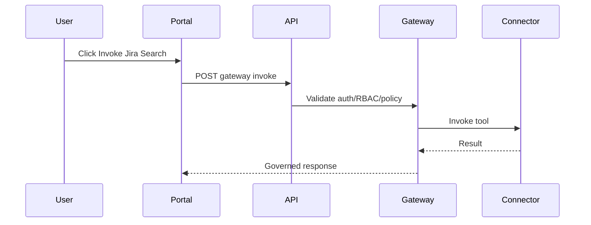

# Apps

This folder contains the runtime applications for the starter kit.

## API And MCP Gateway

Path: `apps/api`

The API owns:

- mock authentication
- registry APIs
- project access APIs
- self-service request APIs
- approval APIs
- policy/RBAC enforcement
- MCP Gateway tool and task execution
- audit events
- metrics and traces
- SIEM audit export

Main local endpoint:

```text
http://localhost:4000
```

Important API paths:

- `POST /auth/dev-token`
- `GET /connectors`
- `GET /skills`
- `GET /tasks`
- `POST /gateway/connectors/{connectorId}/tools/{toolName}/invoke`
- `POST /approvals/{id}/execute`
- `GET /audit/events`
- `GET /metrics`
- `GET /observability/health`

## Web Portal

Path: `apps/web`

The portal is the self-service UI for:

- browsing the connector catalog
- seeing which connectors are runnable locally
- invoking Jira search through the gateway
- demonstrating denied/approval-gated writes
- creating access requests
- proposing new connectors
- viewing generated request artifacts
- reviewing audit events

Main local endpoint:

```text
http://localhost:3000
```

## Local Development

Run the full stack from the repo root:

```bash
npm run platform:start
```

Build just these apps:

```bash
npm run build -w @mcp-platform/api
npm run build -w @mcp-platform/web
```

## Request Flow


