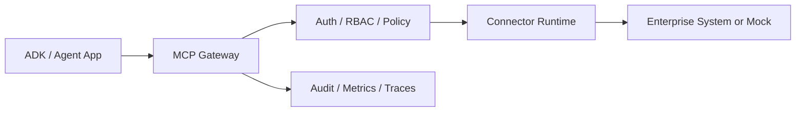

# Connectors

This folder contains MCP connector runtimes and examples.

## What Is Implemented

| Connector | Status | Purpose |
|---|---|---|
| `jira/` | Working local golden connector | Jira search/read/write tools in mock mode and API-token mode |
| `servicenow/` | Working local golden connector | ServiceNow incident tools in mock mode and API-token mode |
| `local-knowledge-base/` | Working local connector | Safe local knowledge base example |
| `mock-jira/`, `mock-github/` | Legacy/simple examples | Lightweight mocks and examples |
| `my-rest-connector/` | Local generated scaffold if present | Created by connector generator; usually not committed unless intended |

Most other enterprise systems appear in the registry as catalog seed metadata only. They are intentionally not implemented here yet.

## Run Through Docker Compose

From the repo root:

```bash
npm run platform:start
```

Connector runtime ports:

- Jira: http://localhost:4200
- ServiceNow: http://localhost:4300
- Local Knowledge Base: http://localhost:4100

## Try The Working Connectors

```bash
npm run demo:jira-search
npm run demo:jira-approved-write
npm run demo:servicenow-search
```

## Build A New Connector

Use the generator from the repo root:

```bash
npm run connector:create -- --name my-rest-connector --template generic-rest-api
```

Generated connectors include:

- `connector.yaml`
- `README.md`
- `.env.example`
- `Dockerfile`
- `src/server.ts`
- `src/tools/`
- `src/resources/`
- `src/prompts/`
- `src/auth/`
- `tests/`

## Connector Runtime Contract

Every production connector should support:

- health check
- manifest discovery
- tool/resource/prompt discovery
- tool invocation
- safe errors
- trace propagation
- audit correlation
- no raw secrets in source or logs

See [../docs/contracts/mcp-connector-runtime-contract.md](../docs/contracts/mcp-connector-runtime-contract.md).

## Gateway Pattern


