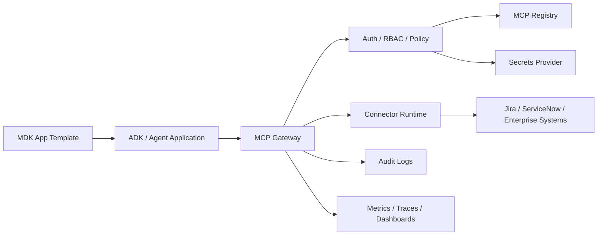
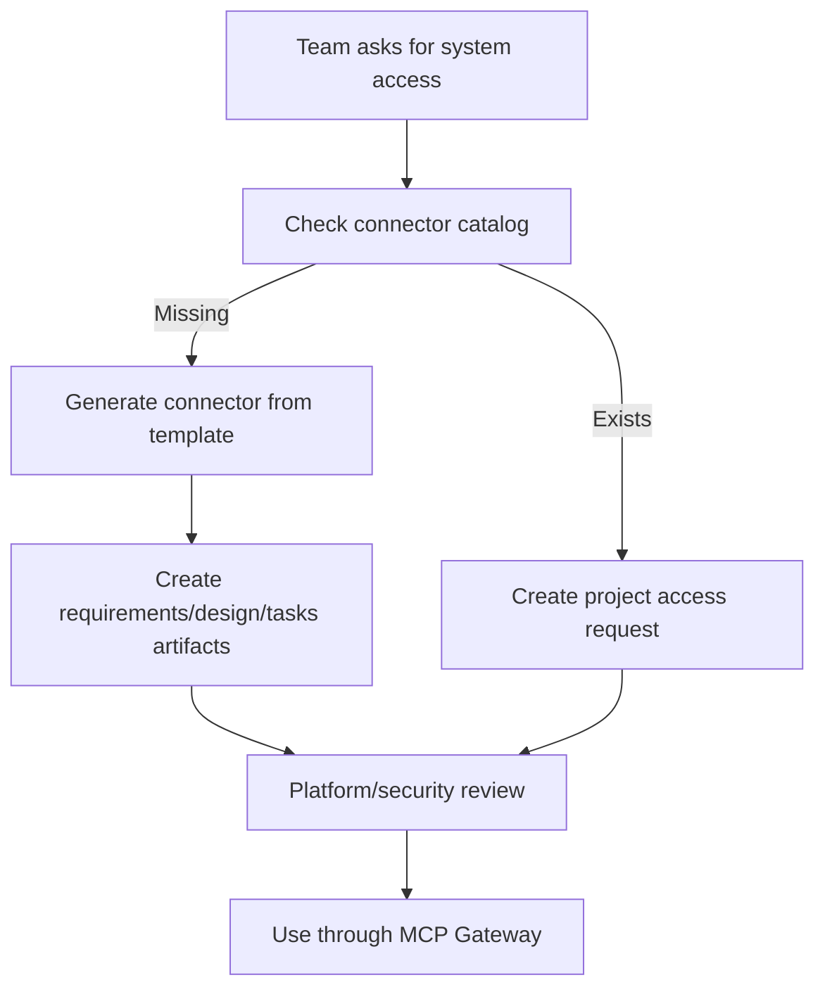
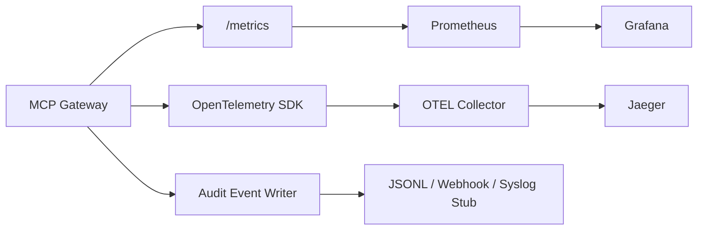

# Documentation

This folder holds the details that used to make the top-level README too large: architecture, operating model, onboarding guides, governance, observability, and diagrams.

## Start Here By Role

| Role | Guide |
|---|---|
| DS / Agent Developer | [onboarding/ds-consume-existing-connector.md](onboarding/ds-consume-existing-connector.md) |
| Connector Owner | [onboarding/connector-owner-build-new-connector.md](onboarding/connector-owner-build-new-connector.md) |
| Platform Admin | [onboarding/platform-admin-approve-connector.md](onboarding/platform-admin-approve-connector.md) |
| Security Reviewer | [onboarding/security-reviewer-checklist.md](onboarding/security-reviewer-checklist.md) |
| ADK Developer | [onboarding/adk-agent-integration-guide.md](onboarding/adk-agent-integration-guide.md) |
| MDK Developer | [onboarding/mdk-template-integration-guide.md](onboarding/mdk-template-integration-guide.md) |

## Architecture

Read next:

- [architecture.md](architecture.md)
- [architecture/centralized-vs-distributed-mcp.md](architecture/centralized-vs-distributed-mcp.md)
- [gateway-model.md](gateway-model.md)
- [contracts/mcp-connector-runtime-contract.md](contracts/mcp-connector-runtime-contract.md)

## Connector Onboarding Flow

Read next:

- [connector-onboarding.md](connector-onboarding.md)
- [jira-connector-onboarding.md](jira-connector-onboarding.md)
- [custom-connector-guide.md](custom-connector-guide.md)
- [template-usage-guide.md](template-usage-guide.md)

## Governance And Runtime Controls

- [rbac-model.md](rbac-model.md)
- [policy-model.md](policy-model.md)
- [security-model.md](security-model.md)
- [secret-management.md](secret-management.md)
- [audit-model.md](audit-model.md)
- [governance/human-approval-workflow.md](governance/human-approval-workflow.md)

## Self-Service And Agent-Assisted Onboarding

- [self-service/self-service-onboarding-model.md](self-service/self-service-onboarding-model.md)
- [self-service/agent-assisted-onboarding.md](self-service/agent-assisted-onboarding.md)
- [self-service/spec-driven-onboarding-agent.md](self-service/spec-driven-onboarding-agent.md)
- [self-service/generated-connector-repo-model.md](self-service/generated-connector-repo-model.md)
- [self-service/request-lifecycle.md](self-service/request-lifecycle.md)

## Observability

Read next:

- [observability.md](observability.md)
- [siem-audit-export.md](siem-audit-export.md)
- [production-hardening-checklist.md](production-hardening-checklist.md)

## Existing Diagrams

- [diagrams/platform-overview.md](diagrams/platform-overview.md)
- [diagrams/connector-onboarding-flow.md](diagrams/connector-onboarding-flow.md)
- [diagrams/gateway-request-flow.md](diagrams/gateway-request-flow.md)
- [diagrams/jira-end-to-end-flow.md](diagrams/jira-end-to-end-flow.md)
- [diagrams/adk-mdk-flow.md](diagrams/adk-mdk-flow.md)
