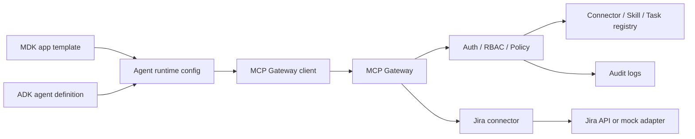
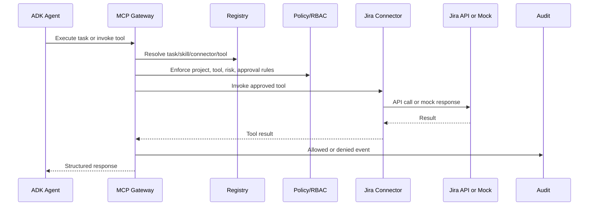

# ADK / MDK Integration

MDK is the platform-provided development kit and template layer for building and deploying AI, ML, and agent applications.

ADK is the agent development layer that defines agent behavior, tool usage, prompts, and workflow logic.

The MCP Platform is the governed tool and connectivity layer. ADK agents should not call Jira, GitHub, ServiceNow, Slack, Confluence, or databases directly. They should call the MCP Gateway.

## Why The Gateway

The gateway provides:

- authentication
- RBAC
- project access checks
- connector and tool authorization
- skill/task resolution
- policy enforcement
- secret reference handling
- audit logging
- rate limiting

## Integration Diagram



## Example ADK Config

```yaml
agent:
  name: incident-response-agent
  allowed_tasks:
    - create-jira-ticket-from-incident
    - summarize-open-incidents

mcp:
  gateway_url: http://localhost:4000
  project_id: ai-platform-demo

skills:
  - incident-response-assistant
  - engineering-ticket-management
```

## Runtime Flow



## Concrete Gateway Call

```bash
curl -s -X POST http://localhost:4000/gateway/connectors/jira/tools/jira.search_issues/invoke \
  -H "authorization: Bearer $TOKEN" \
  -H "content-type: application/json" \
  -d '{
    "projectId": "ai-platform-demo",
    "input": {
      "jql": "project = DEMO ORDER BY created DESC",
      "maxResults": 10
    }
  }'
```

## Guidance For MDK Templates

MDK templates should include:

- `MCP_GATEWAY_URL`
- `MCP_PROJECT_ID`
- token or workload identity configuration
- default skill/task references
- retry and timeout configuration
- audit correlation ID propagation

## Guidance For ADK Agents

ADK agent definitions should reference reusable skills/tasks instead of embedding raw enterprise API details.

Good:

```yaml
allowed_tasks:
  - create-jira-ticket-from-incident
skills:
  - engineering-ticket-management
```

Avoid:

```yaml
tools:
  - direct_jira_api_token
  - raw_jira_rest_call
```

The governed flow is:

`ADK agent -> MCP Gateway -> Policy/RBAC -> Skill/Task resolution -> Connector/tool invocation -> Enterprise system`
