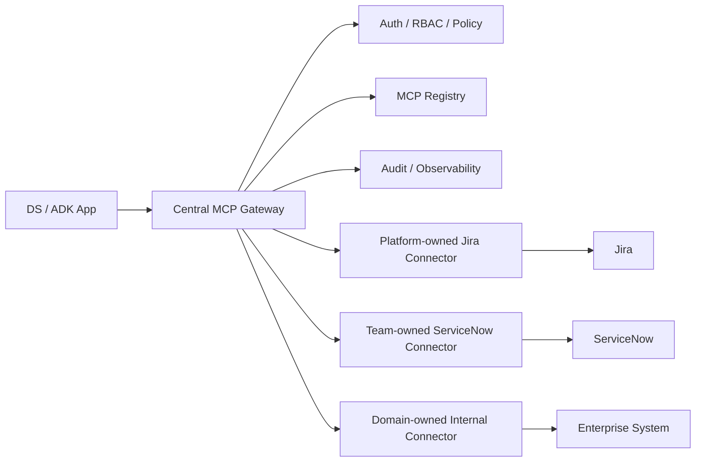

# Centralized vs Distributed MCP

## Recommendation

Use a hybrid MCP model.

Centralized-only bottlenecks the AI Platform team. Distributed-only creates inconsistent auth, policy, audit, support, and observability. Hybrid gives enterprise governance while letting domain teams own their connectors.

## Centralized

AI Platform owns:

- MCP Gateway
- registry
- auth/RBAC
- policy evaluation
- audit pipeline
- observability
- templates
- approval workflow
- onboarding agent framework

## Distributed

Domain teams own:

- team-owned connector runtimes
- domain-specific MCP servers
- custom tools/resources/prompts
- connector-specific support
- connector-specific runtime ownership

## Platform-Owned

AI Platform also owns common connectors, SDKs, templates, runtime contracts, governance docs, and golden path examples such as Jira.

All production execution still flows through MCP Gateway for policy, audit, observability, and secret governance.

