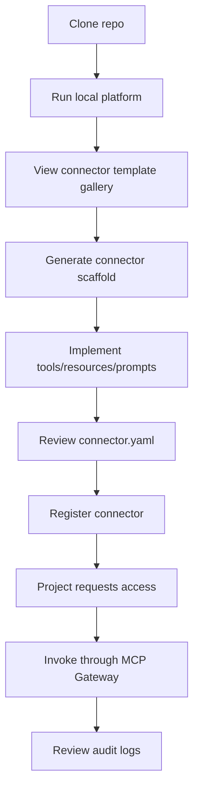

# Connector Onboarding

This repo is designed around paved-road connector onboarding.

## Golden Path



## Start With Jira

The reference connector is `connectors/jira`. It supports:

- mock mode without credentials
- real Jira Cloud API mode
- `jira.search_issues`
- `jira.get_issue`
- `jira.create_issue`
- `jira.add_comment`
- `jira.transition_issue`
- `jira://issues/{issueKey}`
- `jira_bug_triage_prompt`

## Generate A Connector

```bash
npm run create:connector -- --name my-jira-connector --template jira-like-issue-tracker
```

## Register A Connector

Connector manifests live in `registry/connectors`. A generated connector should copy its `connector.yaml` into that registry or be registered through `POST /connectors`.

## Access And Invocation

Projects must request access before agents can invoke connector tools:

```bash
POST /projects/{projectId}/connectors/{connectorId}/request-access
POST /projects/{projectId}/connectors/{connectorId}/approve-access
POST /gateway/connectors/{connectorId}/tools/{toolName}/invoke
```

The gateway writes audit events for both allowed and denied calls.
