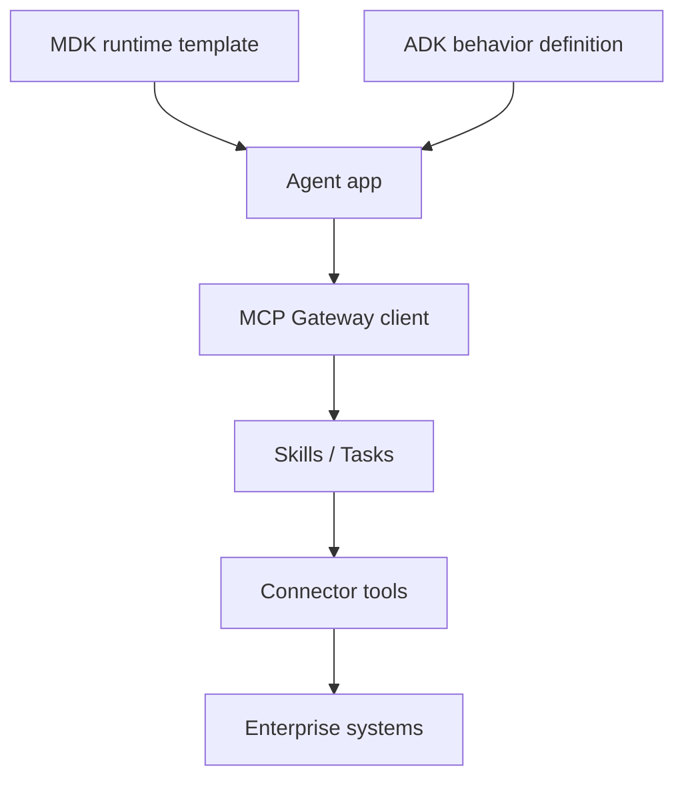

# ADK / MDK Flow

```mermaid
flowchart TD
  MDK["MDK runtime template"] --> Agent["Agent app"]
  ADK["ADK behavior definition"] --> Agent
  Agent --> Gateway["MCP Gateway client"]
  Gateway --> Skills["Skills / Tasks"]
  Skills --> Tools["Connector tools"]
  Tools --> Systems["Enterprise systems"]
```
