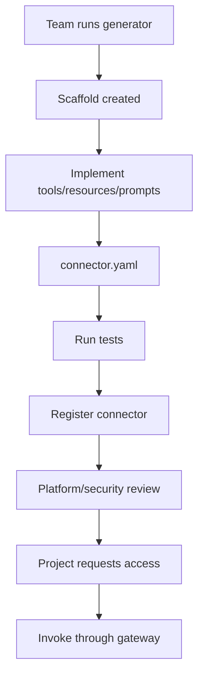

# Connector Onboarding Flow

```mermaid
flowchart TD
  Team["Team runs generator"] --> Scaffold["Scaffold created"]
  Scaffold --> Tools["Implement tools/resources/prompts"]
  Tools --> Manifest["connector.yaml"]
  Manifest --> Tests["Run tests"]
  Tests --> Register["Register connector"]
  Register --> Review["Platform/security review"]
  Review --> Access["Project requests access"]
  Access --> Gateway["Invoke through gateway"]
```
