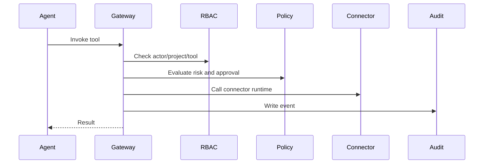

# Gateway Request Flow

```mermaid
sequenceDiagram
  participant Agent
  participant Gateway
  participant RBAC
  participant Policy
  participant Connector
  participant Audit
  Agent->>Gateway: Invoke tool
  Gateway->>RBAC: Check actor/project/tool
  Gateway->>Policy: Evaluate risk and approval
  Gateway->>Connector: Call connector runtime
  Gateway->>Audit: Write event
  Gateway-->>Agent: Result
```
