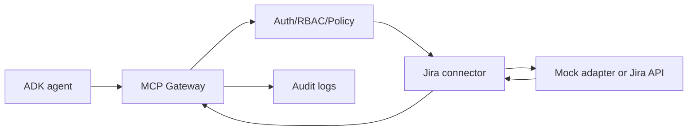

# Jira End-To-End Flow

```mermaid
flowchart LR
  Agent["ADK agent"] --> Gateway["MCP Gateway"]
  Gateway --> Checks["Auth/RBAC/Policy"]
  Checks --> Connector["Jira connector"]
  Connector --> Adapter["Mock adapter or Jira API"]
  Adapter --> Connector
  Connector --> Gateway
  Gateway --> Audit["Audit logs"]
```
