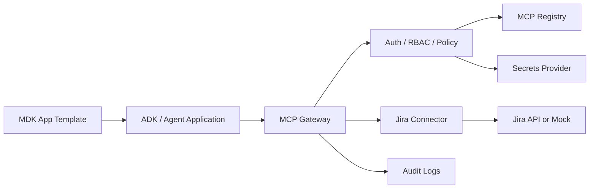

# Platform Overview Diagram

```mermaid
flowchart LR
  Agent["ADK / Agent Application"] --> Gateway["MCP Gateway"]
  MDK["MDK App Template"] --> Agent
  Gateway --> Controls["Auth / RBAC / Policy"]
  Controls --> Registry["MCP Registry"]
  Controls --> Secrets["Secrets Provider"]
  Gateway --> Jira["Jira Connector"]
  Gateway --> Audit["Audit Logs"]
  Jira --> JiraApi["Jira API or Mock"]
```
