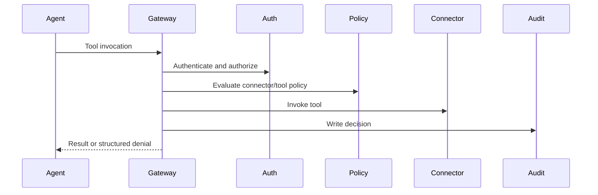

# Gateway Model

The MCP Gateway is the data-plane entrypoint for ADK and MDK applications.

```mermaid
sequenceDiagram
  participant Agent
  participant Gateway
  participant Auth
  participant Policy
  participant Connector
  participant Audit

  Agent->>Gateway: Tool invocation
  Gateway->>Auth: Authenticate and authorize
  Gateway->>Policy: Evaluate connector/tool policy
  Gateway->>Connector: Invoke tool
  Gateway->>Audit: Write decision
  Gateway-->>Agent: Result or structured denial
```
