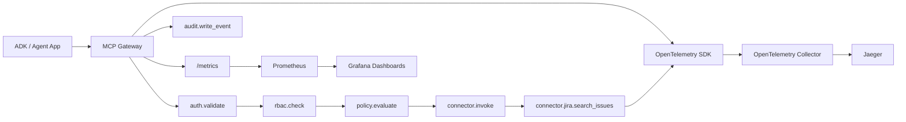

# Observability

This platform ships with a local observability stack that exercises the real gateway path, not just placeholder diagrams.

## Local Stack

The root `compose.yaml` starts:

- MCP Platform API and Gateway on `http://localhost:4000`
- Jira connector mock runtime on `http://localhost:4200`
- OpenTelemetry Collector on `localhost:4317` and `localhost:4318`
- Prometheus on `http://localhost:9090`
- Grafana on `http://localhost:3001`
- Jaeger on `http://localhost:16686`



## Traces

The API initializes OpenTelemetry from `apps/api/src/observability/tracing.ts`. The Jira connector initializes its own SDK from `connectors/jira/src/telemetry.ts`.

Gateway requests create spans for:

- `auth.validate`
- `rbac.check`
- `registry.lookup_connector`
- `registry.lookup_skill`
- `registry.lookup_task`
- `policy.evaluate`
- `gateway.invoke_tool`
- `gateway.execute_task`
- `connector.invoke`
- `audit.write_event`
- `template.generate_connector`

The Jira connector creates spans for:

- `connector.invoke`
- `connector.jira.search_issues`
- `connector.jira.get_issue`
- `connector.jira.create_issue`
- `connector.jira.add_comment`
- `connector.jira.transition_issue`

Trace context is propagated from the gateway to the connector using W3C trace headers.

## Metrics

The API exposes Prometheus metrics at:

```bash
curl http://localhost:4000/metrics
```

Prometheus scrapes the API using `infra/observability/prometheus.yml`.

Important metrics:

- `mcp_gateway_requests_total`
- `mcp_gateway_request_duration_seconds`
- `mcp_tool_invocations_total`
- `mcp_tool_invocation_duration_seconds`
- `mcp_tool_invocation_errors_total`
- `mcp_policy_decisions_total`
- `mcp_policy_denials_total`
- `mcp_rbac_checks_total`
- `mcp_rbac_denials_total`
- `mcp_auth_failures_total`
- `mcp_connector_health_status`
- `mcp_connector_errors_total`
- `mcp_audit_events_total`
- `mcp_template_generations_total`
- `mcp_task_executions_total`
- `mcp_task_execution_duration_seconds`
- `mcp_siem_export_total`
- `mcp_siem_export_duration_seconds`
- `mcp_siem_failed_records_total`

Metric labels are intentionally low-cardinality: connector ID, tool name, decision, reason code, status, risk level, and data classification. The platform does not emit raw request bodies, tokens, prompts, Jira issue text, authorization headers, or trace IDs as metric labels.

## Grafana Dashboards

Grafana is provisioned automatically from:

- `infra/observability/grafana/provisioning/datasources/datasources.yaml`
- `infra/observability/grafana/provisioning/dashboards/dashboards.yaml`
- `infra/observability/grafana/dashboards/*.json`

Open `http://localhost:3001` and browse the `MCP Platform` folder.

Dashboards:

- MCP Platform Overview
- MCP Gateway Runtime
- MCP Connector: Jira
- MCP Policy and RBAC
- MCP Audit and SIEM

## Verify A Jira Trace

1. Start the platform:

```bash
docker compose up --build
```

2. Mint a token:

```bash
DEV_TOKEN=$(curl -s -X POST http://localhost:4000/auth/dev-token \
  -H 'content-type: application/json' \
  -d '{"email":"developer@example.com"}' | jq -r .token)
```

3. Invoke Jira search:

```bash
curl -s -X POST http://localhost:4000/gateway/connectors/jira/tools/jira.search_issues/invoke \
  -H "authorization: Bearer $DEV_TOKEN" \
  -H "content-type: application/json" \
  -H "x-correlation-id: demo-trace-001" \
  -d '{"projectId":"ai-platform-demo","input":{"jql":"project = DEMO ORDER BY created DESC","maxResults":5}}'
```

4. Open Jaeger at `http://localhost:16686`, select `mcp-platform-api`, and search recent traces.

5. Open Grafana at `http://localhost:3001` and inspect the gateway and Jira dashboards.

## Health And Config Endpoints

```bash
curl http://localhost:4000/observability/health
curl http://localhost:4000/observability/config
```

These endpoints report whether metrics, tracing, and SIEM audit export are enabled and show the configured collector/exporter endpoints.
