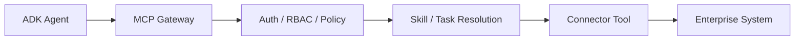

# ADK Agent Integration Guide

## Who This Is For

ADK developers who define agent behavior, prompts, tasks, and tool usage.

## Prerequisites

- MCP Platform running locally
- Gateway URL, project ID, and allowed skills/tasks
- Agent runtime capable of making HTTP requests

## Model

ADK should define agent behavior. MCP Platform should own governed enterprise connectivity.



ADK agents should not call Jira, GitHub, ServiceNow, Slack, or databases directly.

## Example Agent Config

```yaml
agent:
  name: incident-response-agent
  allowed_tasks:
    - create-jira-ticket-from-incident
    - summarize-open-incidents

mcp:
  gateway_url: http://localhost:4000
  project_id: ai-platform-demo

skills:
  - incident-response-assistant
  - engineering-ticket-management
```

## Local Test

```bash
npm run platform:start
npm run demo:jira-search
npm run demo:jira-denied-write
```

Expected:

- Jira search succeeds through MCP Gateway.
- Jira write is denied until approval/write access exists.

## Direct HTTP Example

```bash
DEV_TOKEN=$(curl -s -X POST http://localhost:4000/auth/dev-token \
  -H 'content-type: application/json' \
  -d '{"email":"developer@example.com"}' | jq -r .token)

curl -s -X POST http://localhost:4000/gateway/connectors/jira/tools/jira.search_issues/invoke \
  -H "authorization: Bearer $DEV_TOKEN" \
  -H "content-type: application/json" \
  -d '{"projectId":"ai-platform-demo","input":{"jql":"project = DEMO ORDER BY created DESC","maxResults":10}}'
```

## Platform Controls Applied

- Authentication
- RBAC
- Project access
- Connector access
- Tool-level policy
- Human approval for write tools
- Secret references
- Rate limits
- Audit logs
- OpenTelemetry traces
- Prometheus metrics
- SIEM audit export

## Troubleshooting

- `401`: token missing or expired.
- `403`: project/tool/policy denied the request.
- Direct Jira call in agent code: replace it with MCP Gateway invocation.
- No trace: run `npm run demo:observability`.

## Verify Success

- Agent config references MCP Gateway.
- Agent can call Jira search through gateway.
- Write tool is denied.
- Audit event exists for each call.
