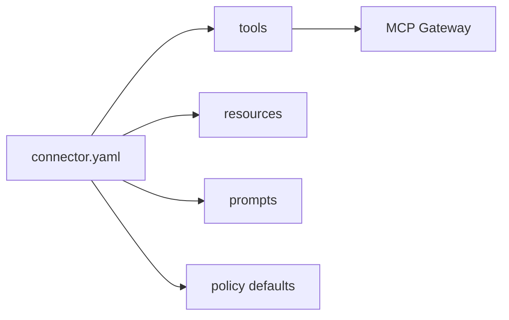

# Connector Owner Guide: Build A New Connector

## Who This Is For

Connector owners who need to onboard an enterprise system such as ServiceNow, GitHub, Confluence, Slack, or an internal API.

## Prerequisites

- Node.js 20+
- Docker Desktop
- Basic knowledge of the target system API
- No real secrets committed to source

## Generate A Connector

```bash
npm install
npm run connector:create -- --name my-servicenow-connector --template generic-rest-api
```

Other templates:

```bash
npm run connector:create -- --name my-jira-connector --template jira-like-issue-tracker
npm run connector:create -- --name my-rest-connector --template generic-rest-api
npm run connector:create -- --name my-docs-connector --template document-retrieval
```

Expected output:

```text
Created connector scaffold at generated-connectors/my-servicenow-connector
```

Generated connectors include:

- `connector.yaml`
- `README.md`
- `.env.example`
- `Dockerfile`
- `src/server.ts`
- `src/tools/`
- `src/resources/`
- `src/prompts/`
- `src/auth/`
- `tests/`
- local fixture
- registration instructions

## Implement Capabilities



Use the generated tool files as the contract between the gateway and connector runtime. Add read tools first, then write tools with explicit approval requirements.

## Register The Connector

Add or update a registry manifest under `registry/connectors/`.

Example fields:

```yaml
id: servicenow
name: ServiceNow MCP Connector
owner_team: it-platform
status: pending_review
risk_level: high
data_classification: confidential
auth_type: api_token
runtime_type: managed
```

## Local Validation

```bash
npm run build
npm test
docker compose config
```

If your connector is part of compose, run:

```bash
docker compose up --build --wait
```

## Submit For Review

Connector owners submit:

- `connector.yaml`
- README with local startup instructions
- `.env.example` containing placeholders only
- test output
- security checklist
- list of write tools and approval expectations

## Troubleshooting

- Manifest validation fails: compare with `registry/connectors/jira.yaml`.
- Gateway cannot invoke runtime: confirm connector health endpoint and compose service URL.
- Secret handling rejected: use secret references, not raw tokens.
- Write tool denied: expected until project write access and approvals exist.

## Verify Success

- Connector scaffold exists.
- Tests pass.
- Registry manifest is present.
- Security can review risk/data classification.
- Approved projects can invoke read tools through MCP Gateway.
