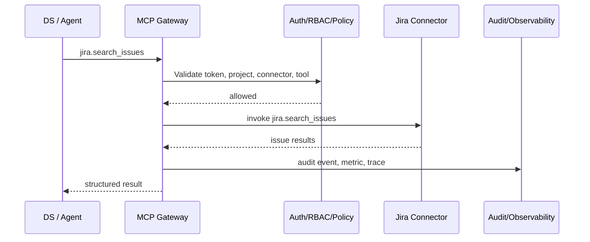

# DS Onboarding: Consume An Existing Connector

## Who This Is For

Data scientists and agent developers who want an agent to use an approved enterprise connector, starting with Jira.

## Prerequisites

- Node.js 20+
- Docker Desktop
- This repo cloned locally

## Flow



## Start The Platform

```bash
npm install
npm run platform:start
```

Expected: Docker reports healthy services for API, web, Postgres, Jira, Prometheus, Grafana, Jaeger, and OTEL Collector.

Open:

- Portal: `http://localhost:3000`
- API: `http://localhost:4000`
- Grafana: `http://localhost:3001`
- Jaeger: `http://localhost:16686`

## Find Jira In The Connector Catalog

Open `http://localhost:3000`, use `developer@example.com`, and select Connector Catalog. Pick Jira Connector and review tools:

- `jira.search_issues`
- `jira.get_issue`
- `jira.create_issue`
- `jira.add_comment`
- `jira.transition_issue`

For the local MVP, `ai-platform-demo` already has read access to Jira.

## Invoke Jira Search

```bash
npm run demo:jira-search
```

Expected response shape:

```json
{
  "requestId": "demo-jira-search-...",
  "connectorId": "jira",
  "toolName": "jira.search_issues",
  "issueCount": 2
}
```

Equivalent curl:

```bash
DEV_TOKEN=$(curl -s -X POST http://localhost:4000/auth/dev-token \
  -H 'content-type: application/json' \
  -d '{"email":"developer@example.com"}' | jq -r .token)

curl -s -X POST http://localhost:4000/gateway/connectors/jira/tools/jira.search_issues/invoke \
  -H "authorization: Bearer $DEV_TOKEN" \
  -H "content-type: application/json" \
  -d '{"projectId":"ai-platform-demo","input":{"jql":"project = DEMO ORDER BY created DESC","maxResults":10}}'
```

## Try A Denied Write

```bash
npm run demo:jira-denied-write
```

Expected: HTTP `403` or `409` with a safe reason. This proves governance is enforced at runtime.

## View Audit Events

```bash
npm run demo:audit-events
```

Expected: recent `tool.invoke` events for `jira.search_issues` and `jira.create_issue`, including `decision`, `reasonCode`, and `traceId`.

## View Metrics

```bash
curl -s http://localhost:4000/metrics | grep mcp_gateway_requests_total
```

Expected: counters labeled with `connector_id="jira"` and safe labels such as `tool_name`, `decision`, `reason_code`, `risk_level`, and `data_classification`.

## View Grafana And Jaeger

```bash
npm run demo:observability
```

Open Grafana at `http://localhost:3001`, then browse the `MCP Platform` folder.

Open Jaeger at `http://localhost:16686`, then search services:

- `mcp-platform-api`
- `mcp-jira-connector`

Expected spans include `auth.validate`, `rbac.check`, `policy.evaluate`, `gateway.invoke_tool`, `connector.invoke`, `connector.jira.search_issues`, and `audit.write_event`.

## Add MCP Gateway To ADK Agent Config

```yaml
agent:
  name: incident-response-agent
  allowed_tasks:
    - create-jira-ticket-from-incident
    - summarize-open-incidents

mcp:
  gateway_url: http://localhost:4000
  project_id: ai-platform-demo

skills:
  - engineering-ticket-management
```

## Troubleshooting

- `ECONNREFUSED`: run `npm run platform:start`.
- `401`: mint a new dev token.
- `403`: project or tool policy denied the call; check audit events.
- No metrics: open `http://localhost:4000/observability/health`.
- No traces: confirm Jaeger has `mcp-platform-api` and `mcp-jira-connector`.

## Verify Success

- Jira search returns mock issues.
- Jira write is denied.
- Audit events show allowed and denied calls.
- Prometheus has gateway metrics.
- Grafana dashboards are provisioned.
- Jaeger shows gateway and Jira connector spans.
