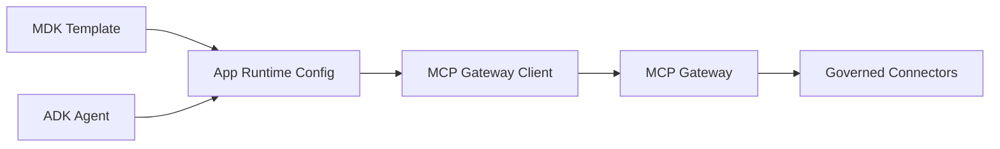

# MDK Template Integration Guide

## Who This Is For

MDK developers who provide app/runtime templates for AI and agent applications.

## Prerequisites

- MCP Platform Gateway URL
- Project ID
- Runtime auth strategy
- Allowed skills/tasks for the app template

## Model

MDK provides the deployable app/runtime template. ADK supplies agent behavior. MCP Platform supplies governed tool access.



MDK templates should include MCP Gateway client configuration instead of direct enterprise-system SDK configuration.

## Template Config

```yaml
template:
  name: incident-response-mdk-template
  runtime: node20

mcp_gateway_client:
  gateway_url: http://localhost:4000
  project_id: ai-platform-demo
  auth:
    provider: local-dev-jwt

allowed_skills:
  - incident-response-assistant
  - engineering-ticket-management

allowed_tasks:
  - create-jira-ticket-from-incident
  - summarize-open-incidents
```

## Local Test

```bash
npm run platform:start
npm run demo:jira-search
npm run demo:observability
```

Expected:

- Gateway URL is reachable.
- Project ID is accepted.
- Runtime calls generate metrics, audit events, and traces.

## Troubleshooting

- App template has Jira credentials: remove them and use MCP Gateway config.
- Wrong project ID: gateway returns a policy denial.
- Missing skill/task: update registry manifests and ADK config.
- No observability data: run a gateway call and check `/metrics`.

## Verify Success

- MDK template has MCP Gateway config.
- ADK agent logic references governed skills/tasks.
- App calls MCP Gateway for enterprise tools.
- Platform controls apply consistently across apps.
