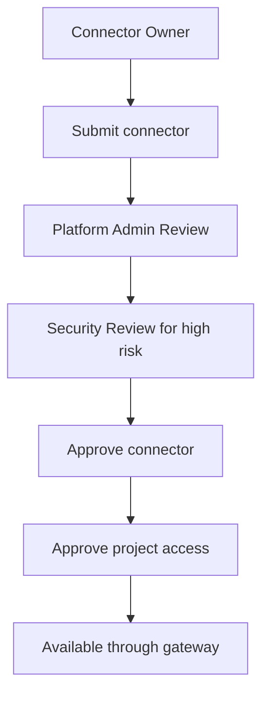

# Platform Admin Guide: Approve Connector Usage

## Who This Is For

Platform admins who manage connector registration, approval, and project access.

## Prerequisites

- Local stack running with `npm run platform:start`
- Admin dev token for `admin@example.com`
- Connector manifest submitted by connector owner

## Review Connector Registry State

```bash
ADMIN_TOKEN=$(curl -s -X POST http://localhost:4000/auth/dev-token \
  -H 'content-type: application/json' \
  -d '{"email":"admin@example.com"}' | jq -r .token)

curl -s http://localhost:4000/connectors/jira \
  -H "authorization: Bearer $ADMIN_TOKEN"
```

Expected: connector metadata, tools, resources, prompts, status, risk level, data classification, auth type, and required scopes.

## Approval Flow



## Approve Connector Access

Local seed data already approves Jira access for `ai-platform-demo`. To inspect the runtime effect:

```bash
npm run demo:jira-search
npm run demo:jira-denied-write
```

Expected:

- `jira.search_issues` allowed.
- `jira.create_issue` denied unless write approval is granted.

## Monitor Usage

```bash
curl -s http://localhost:4000/metrics | grep mcp_gateway_requests_total
npm run demo:audit-events
npm run demo:observability
```

Open Grafana at `http://localhost:3001` and review:

- MCP Platform Overview
- MCP Gateway Runtime
- MCP Policy and RBAC
- MCP Audit and SIEM

## Troubleshooting

- Connector does not appear: confirm seed or registry import ran.
- Project cannot invoke connector: inspect project connector access request status.
- Admin cannot approve: confirm role assignment includes `connector:approve`.
- Metrics are empty: run a gateway demo first.

## Verify Success

- Connector status is approved.
- Project access is approved.
- Read tool calls succeed.
- Write tools are blocked or approval-required.
- Audit events and dashboards show activity.
