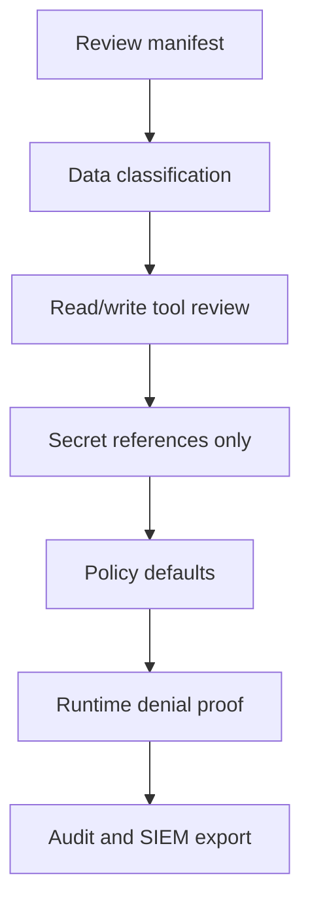

# Security Reviewer Checklist

## Who This Is For

Security reviewers validating connector risk, secret handling, write actions, and runtime auditability.

## Prerequisites

- Connector manifest
- Connector README
- `.env.example`
- Test output
- Local platform running for runtime proof

## Checklist



## Manifest Review

Check:

- `owner_team`
- `status`
- `runtime_type`
- `auth_type`
- `risk_level`
- `data_classification`
- `required_scopes`
- tools/resources/prompts
- write tool approval defaults

Jira write tools are high-risk by default:

- `jira.create_issue`
- `jira.add_comment`
- `jira.transition_issue`

## Secret Handling

Secrets must be references only:

```yaml
secret_ref: local/jira/api-token
secret_provider: local_mock
secret_version: v1
allowed_runtime_identity: mcp-gateway-local
```

Do not approve manifests or docs that include raw API tokens, OAuth refresh tokens, passwords, cookies, or Authorization headers.

## Runtime Proof

```bash
npm run platform:start
npm run demo:jira-search
npm run demo:jira-denied-write
npm run demo:audit-events
```

Expected:

- Read action allowed.
- Write action denied or approval-required.
- Denied response includes safe reason and request ID.
- Audit event includes `traceId`, `requestId`, `decision`, `reasonCode`, risk level, and data classification.

## Observability Proof

```bash
npm run demo:observability
```

Open:

- Prometheus: `http://localhost:9090`
- Grafana: `http://localhost:3001`
- Jaeger: `http://localhost:16686`

Expected:

- `mcp_policy_denials_total` increments for denied write action.
- Grafana dashboards show request and audit activity.
- Jaeger includes gateway, policy, connector, and audit spans.
- SIEM JSONL export writes sanitized events.

## Troubleshooting

- Missing audit event: verify `audit.write_event` span and `/audit/events`.
- Sensitive data in telemetry: fix sanitizer or connector metadata before approval.
- Write tool allowed unexpectedly: review project write access and policy constraints.
- No trace: confirm OTEL Collector and Jaeger are healthy.

## Verify Success

- High-risk tools are gated.
- Raw secrets are absent.
- Runtime denial is proven.
- Audit export is sanitized and SIEM-compatible.
