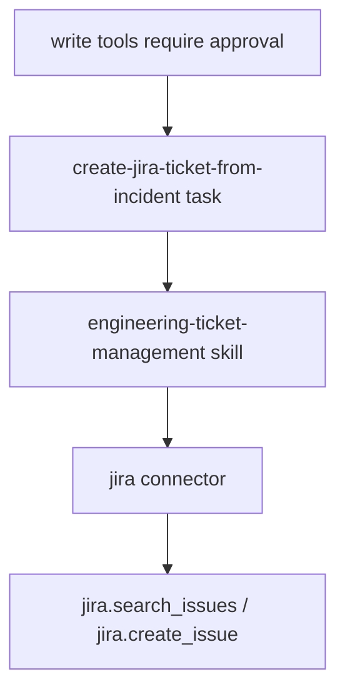

# Registry Model

The registry stores desired connector, skill, task, policy, approval, and eval definitions in Git and live runtime state in PostgreSQL.

Jira example:

- connector: `registry/connectors/jira.yaml`
- skill: `registry/skills/engineering-ticket-management.yaml`
- task: `registry/tasks/create-jira-ticket-from-incident.yaml`

