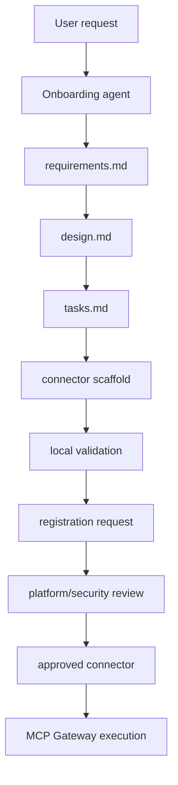

# Agent-Assisted Onboarding

The onboarding agent accelerates intake, scaffolding, validation, and review package creation. It does not bypass governance.

Platform/security approval is still required for production use, restricted data, and high-risk write tools.

The agent must ask intake questions, check the registry, recommend reuse or build, generate SDD artifacts, create a scaffold, run validation, and route the result to review.

