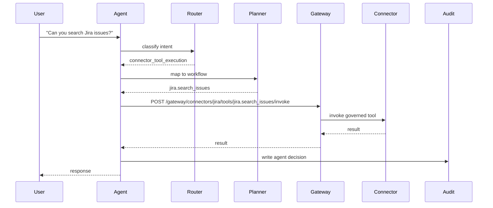

# Natural Language To MCP Workflow

The agent turns plain English into MCP Platform actions.



The agent never calls Jira, ServiceNow, GitHub, Slack, databases, or any enterprise system directly. It either creates a platform request or calls MCP Gateway.

## Examples

```bash
npm run demo:agent-search-jira
npm run demo:agent-create-servicenow-ticket
npm run demo:agent-onboard-servicenow
```

Use `examples/agent-requests/` to see the raw request payloads.
