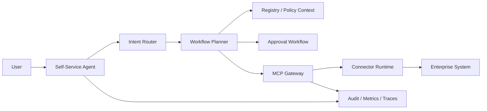

# Self-Service Agent Orchestrator

The Self-Service Agent is the natural-language front door for the MCP Platform. It helps users ask for connector access, new connector onboarding, connector repo generation, and governed tool execution without learning every API first.

It does not bypass governance. Runtime connector calls still go through MCP Gateway.



## Supported MVP Intents

| Intent | Example | Output |
|---|---|---|
| `existing_connector_access_request` | “I need Jira access.” | Access request |
| `new_connector_onboarding` | “Onboard to a missing connector.” | SDD onboarding request |
| `connector_tool_execution` | “Search Jira issues.” | Gateway invocation |
| `approval_required_action` | High-risk write action | Approval request |
| `registry_lookup` | “What connectors exist?” | Registry lookup plan |
| `generated_connector_repo_request` | “Generate a ServiceNow connector repo.” | Repo generation request |
| `unsupported_or_ambiguous_request` | Vague or unsupported text | Clarification response |

## Local API

```bash
curl -s -X POST http://localhost:4000/agent/request \
  -H "authorization: Bearer $DEV_TOKEN" \
  -H "content-type: application/json" \
  -d @examples/agent-requests/search-jira-issues.json
```

The API returns a plan plus the next governed step. For allowed read tools, the agent invokes the MCP Gateway. For approval-gated write tools, the agent creates the approval path and returns `approval_required`.
