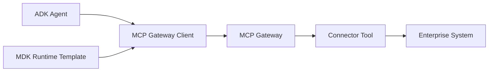

# Examples

Runnable and reference examples for teams adopting the MCP Platform starter kit.

## Examples

| Folder | Purpose |
|---|---|
| `adk-agent-jira-search/` | Shows an ADK-style agent calling MCP Gateway for Jira search |
| `mdk-app-template-with-mcp-gateway/` | Shows how an MDK app template should include MCP Gateway configuration |
| `generated-connectors/sample-servicenow/` | Shows what a generated connector scaffold looks like after light customization |
| `self-service/` | Sample access requests and connector onboarding requests |
| `connectors/`, `skills/`, `tasks/` | Additional manifest examples |

## Recommended Reading Order

1. [adk-agent-jira-search/README.md](adk-agent-jira-search/README.md)
2. [mdk-app-template-with-mcp-gateway/README.md](mdk-app-template-with-mcp-gateway/README.md)
3. [generated-connectors/sample-servicenow/](generated-connectors/sample-servicenow/)
4. [self-service/agent-assisted-servicenow-onboarding.md](self-service/agent-assisted-servicenow-onboarding.md)

## Integration Pattern

The important rule: examples call MCP Gateway, not Jira, ServiceNow, GitHub, Slack, or databases directly.
