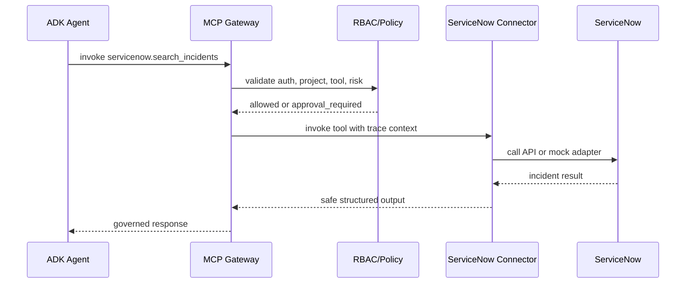

# Servicenow MCP Connector Design

## Connector Architecture

The connector is a team-owned remote MCP runtime. ADK/MDK apps call MCP Gateway; MCP Gateway performs auth, RBAC, policy, audit, metrics, and trace propagation before routing to this connector.

## MCP Tools

- servicenow.search_incidents: read-only incident search.
- servicenow.get_incident: read a single incident.
- servicenow.create_incident: high-risk write action, approval_required.
- servicenow.update_incident: high-risk write action, approval_required.

## MCP Resources

- servicenow://incidents/{number}

## MCP Prompts

- servicenow_incident_triage_prompt

## Runtime Deployment Mode

remote: service-management-platform deploys and operates the connector runtime. AI Platform owns gateway routing and governance controls.

## Auth And Secret Handling

Production credentials are referenced by secret_ref only. Raw tokens must not be committed, stored in the registry, or exported in telemetry.

## Gateway Interaction

Agent -> MCP Gateway -> Auth/RBAC/Policy -> Connector runtime -> ServiceNow API or mock adapter.

## Policy Enforcement

Read tools require approved project access. Write tools return approval_required unless the project has explicit write automation approval.

## Trace, Metric, And Audit Behavior

The connector accepts trace context from the gateway, emits connector spans, returns safe errors, and includes request_id in responses.

## Failure Modes

- ServiceNow unavailable: return CONNECTOR_UPSTREAM_UNAVAILABLE.
- Invalid input: return CONNECTOR_VALIDATION_FAILED.
- Missing credentials: fail startup in real mode.
- Policy denial: gateway denies before connector invocation.

## Ownership Model

service-management-platform owns implementation, tests, runtime SLO, upstream API changes, and connector-specific support.

## Sequence Diagram

