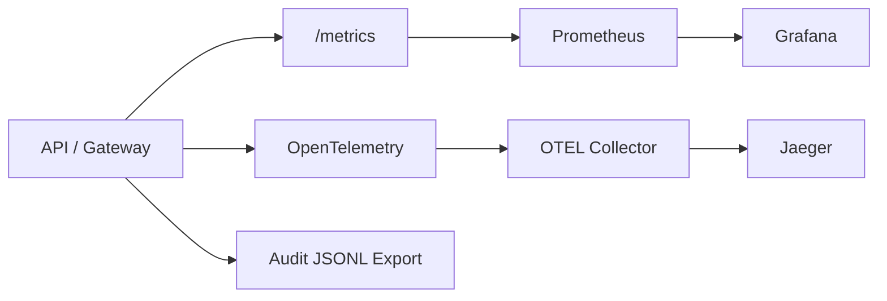

# Infrastructure

Local infrastructure for running the full MCP Platform starter kit.

## Start Everything

From the repo root:

```bash
npm run platform:start
```

Stop:

```bash
npm run platform:stop
```

Validate Compose:

```bash
docker compose config
```

## Local Services

| Service | URL |
|---|---|
| Web portal | http://localhost:3000 |
| API / MCP Gateway | http://localhost:4000 |
| Jira connector | http://localhost:4200 |
| ServiceNow connector | http://localhost:4300 |
| Local Knowledge Base connector | http://localhost:4100 |
| Prometheus | http://localhost:9090 |
| Grafana | http://localhost:3001 |
| Jaeger | http://localhost:16686 |
| OTEL Collector | `localhost:4317`, `localhost:4318` |
| Postgres | `localhost:5432` |

## Observability Stack



Grafana dashboards and datasource provisioning live under:

- `observability/grafana/provisioning/`
- `observability/grafana/dashboards/`

Prometheus config:

- `observability/prometheus.yml`

OTEL Collector config:

- `observability/otel-collector-config.yaml`

More detail: [../docs/observability.md](../docs/observability.md).
