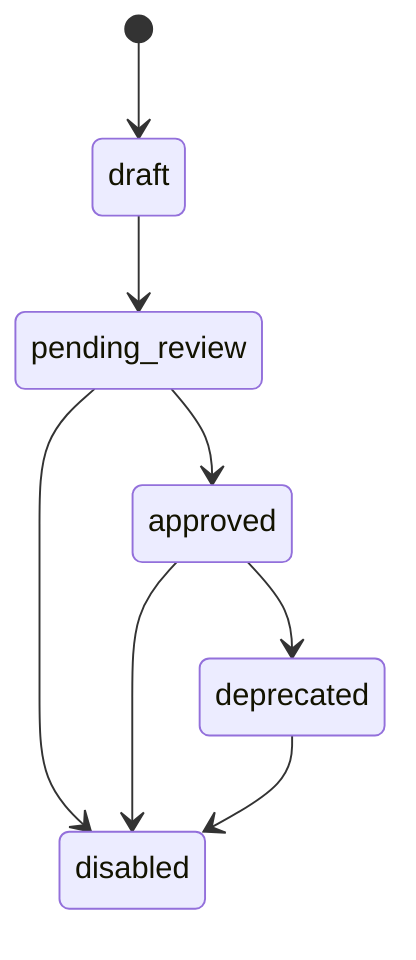
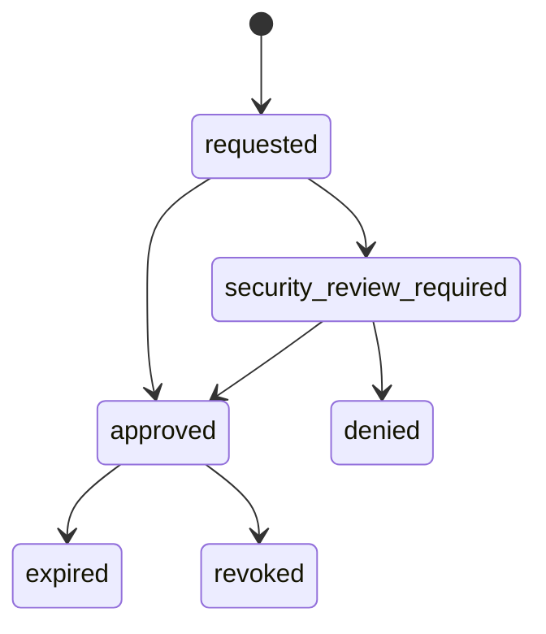

# Registry

This folder is the Git-backed desired-state catalog for connectors, skills, tasks, policies, approvals, requests, and eval examples.

Runtime state still belongs in the database, not Git. Do not store OAuth tokens, access tokens, sessions, live audit logs, production approval records, or raw secrets here.

## Key Folders

| Folder | Purpose |
|---|---|
| `connectors/` | Connector manifests such as Jira, ServiceNow, GitHub, Slack |
| `skills/` | Governed capabilities composed from connectors/tools/resources/prompts |
| `tasks/` | Platform-owned workflow definitions using skills |
| `policies/` | Access, tool execution, write-action, restricted-data policies |
| `approvals/` | Approval workflow examples |
| `requests/` | Self-service request examples |
| `evals/` | Skill and task validation examples |

## Why Some Connectors Are Draft

Only a few connectors are wired end to end in this starter kit:

- `jira`
- `servicenow`
- `local-knowledge-base`

Other enterprise connectors are seed metadata so teams can see the future catalog shape. They should stay `draft` until a connector owner implements, tests, registers, and routes them through review.

## Connector Lifecycle

## Access Request Lifecycle

## Authoring Rules

- Use secret references, never raw secrets.
- Mark write tools as approval-required by default.
- Include `owner_team`, `runtime_owner`, `security_reviewer`, and `deployment_mode`.
- Use `approved` only for connectors with an actual runnable implementation and review path.
- Keep Git definitions versioned; keep runtime approvals and audit events in the database.

More detail: [../docs/registry-model.md](../docs/registry-model.md).
